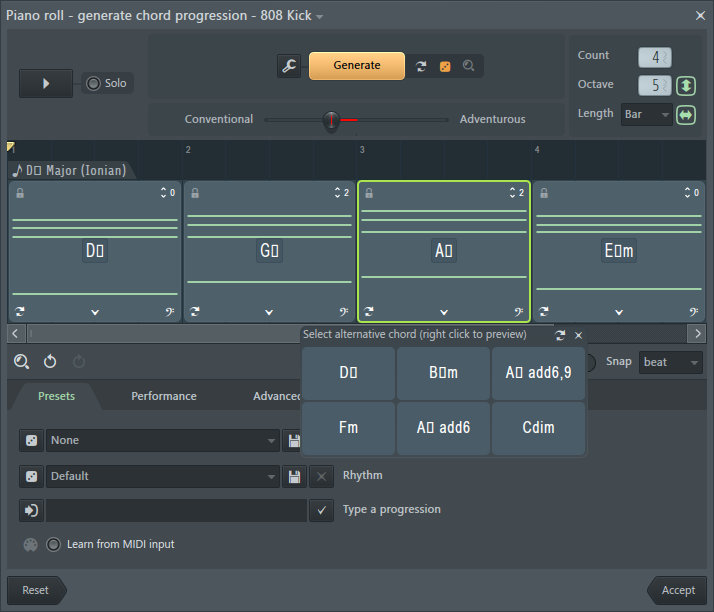
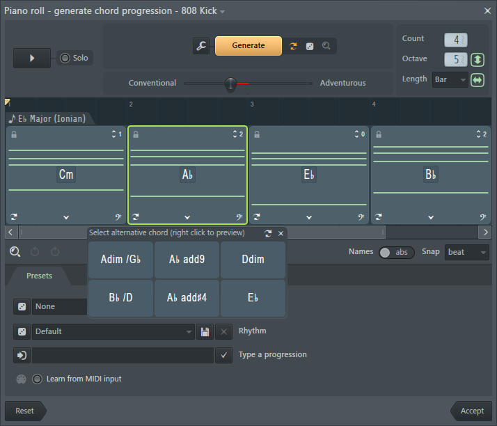

# 🎹 FL Studio Wine Font Fix

[](https://www.winehq.org/)
[](https://www.image-line.com/)
[](LICENSE)

**Fix missing musical symbols (♭ ♮ ♯) in FL Studio running under Wine**

## 🎵 The Problem

When running FL Studio under Wine, **flat (♭) and sharp (♯) symbols** appear as tofu boxes (□) in the Piano Roll chord detection.

| Before | After |
|--------|-------|
|  |  |
| `E□m`, `A□`, `G□m /D□` | `E♭m`, `A♭`, `G♯m /D♯` |

## 🔍 Root Cause

After extensive debugging with Wine's `+font` and `+dwrite` channels, we discovered:

1. **Without Windows fonts**: Wine uses Cantarell (via fontconfig) which lacks both ♭ and ♯
2. **With Segoe UI**: Has ♯ but NOT ♭
3. **FL Studio uses low-level DirectWrite APIs** (`GetGlyphIndices`) that bypass font fallback

| Font | ♭ Flat (U+266D) | ♯ Sharp (U+266F) |
|------|-----------------|------------------|
| Cantarell | ❌ Missing | ❌ Missing |
| Segoe UI | ❌ Missing | ✅ Present |
| Segoe UI Symbol | ✅ Present | ✅ Present |
| **DejaVu Sans** | ✅ Present | ✅ Present |

## ✅ Solutions

We offer two solutions. **Solution 1 (Recommended)** is cleaner as it uses only open-source fonts.

### Solution 1: DejaVu Sans as Segoe UI (Recommended) 🌟

This solution uses **DejaVu Sans** (open-source, SIL License) renamed to "Segoe UI". No Microsoft fonts needed!

```bash
# Clone the repo
git clone https://github.com/giang17/flstudio-wine-font-fix.git
cd flstudio-wine-font-fix

# Run the fix (uses default WINEPREFIX ~/.wine)
./fix-dejavu-as-segoeui.sh

# Or specify a custom WINEPREFIX
./fix-dejavu-as-segoeui.sh /path/to/your/wineprefix
```

**Advantages:**
- ✅ Uses open-source font (DejaVu Sans, SIL License)
- ✅ No Microsoft font patching required
- ✅ Works on fresh Wine installations
- ✅ Both ♭ and ♯ symbols included natively

### Solution 2: Patch Segoe UI (Original)

If you already have Segoe UI installed and prefer to patch it:

```bash
./fix-flat-symbol.sh
```

This copies missing glyphs from Segoe UI Symbol into Segoe UI.

## 📋 Requirements

- Python 3
- python3-fonttools
- DejaVu Sans font (for Solution 1)

```bash
# Ubuntu/Debian
sudo apt install python3-fonttools fonts-dejavu-core

# Or via pip
pip3 install fonttools
```

## 🔄 Restore Original Font

Both scripts create automatic backups. To restore:

```bash
# For Solution 1
rm ~/.wine/drive_c/windows/Fonts/segoeui.ttf
rm ~/.wine/drive_c/windows/Fonts/segoeuib.ttf

# For Solution 2
cp ~/.wine/drive_c/windows/Fonts/segoeui.ttf.backup \
   ~/.wine/drive_c/windows/Fonts/segoeui.ttf
```

## 🔧 Technical Details

### Why Font Fallback Doesn't Work

We tested multiple approaches that do NOT work:

| Approach | Result | Reason |
|----------|--------|--------|
| Fontconfig aliases | ❌ | Wine DirectWrite doesn't use fontconfig for font matching |
| Wine Registry FontSubstitutes | ❌ | DirectWrite bypasses GDI font substitution |
| Wine dwrite.dll patch | ❌ | `GetGlyphIndices` can't do fallback (per Wine devs) |

FL Studio uses these DirectWrite APIs:
- `IDWriteFontFace::GetGlyphIndices` (direct glyph lookup)
- `IDWriteFactory::CreateGlyphRunAnalysis` (direct rendering)

FL Studio does **NOT** use APIs that trigger fallback:
- ❌ `IDWriteTextLayout`
- ❌ `IDWriteFontFallback::MapCharacters`

**The only solution is to ensure the requested font contains the glyphs directly.**

### Clean WINEPREFIX Test Results

| WINEPREFIX Configuration | UI Font | ♭ Result | ♯ Result |
|--------------------------|---------|----------|----------|
| Clean (no fonts) | Cantarell | ❌ TOFU | ❌ TOFU |
| With original Segoe UI | Segoe UI | ❌ TOFU | ✅ OK |
| With patched Segoe UI | Segoe UI | ✅ OK | ✅ OK |
| **DejaVu Sans as Segoe UI** | DejaVu Sans | ✅ OK | ✅ OK |

### Environment Tested

- **Wine**: 11.0
- **OS**: Ubuntu 24.04 LTS
- **FL Studio**: 2025 (FL64.exe)

## 🐛 Related

- [Wine Bug #59252](https://bugs.winehq.org/show_bug.cgi?id=59252) - Original bug report with full analysis

## 📁 Files

| File | Description |
|------|-------------|
| `fix-dejavu-as-segoeui.sh` | **Recommended** - Uses DejaVu Sans renamed to Segoe UI |
| `fix-flat-symbol.sh` | Original - Patches Segoe UI with glyphs from Segoe UI Symbol |
| `patch-segoeui.py` | Python patching script for Solution 2 |
| `screenshots/` | Before/after screenshots |

## 🤝 Contributing

Found another missing symbol? Have a fix for a different font? PRs welcome!

## 📜 License

MIT License - See [LICENSE](LICENSE)

## 🙏 Acknowledgments

- Wine developers for DirectWrite implementation
- Nikolay Sivov for DirectWrite expertise and guidance
- The Wine and FL Studio community

---

**Made with ♭♮♯ for the music production community**